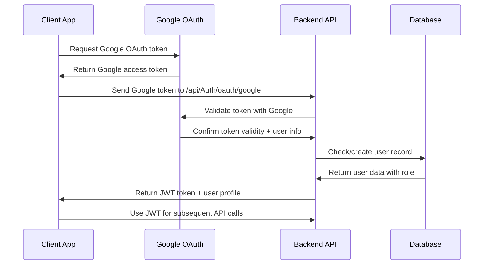

# 🚀 HOSTARA PROJECT - ULTIMATE PROJECT CONTEXT

**Version:** 3.0  
**Date:** September 30, 2025  
**Launch Target:** October 1, 2025 (TODAY + 1 DAY) 🎯  
**Project Type:** Multi-Service Marketplace Platform for Kenya  
**Status:** PRODUCTION READY - FINAL LAUNCH PREPARATION  

---

## 📋 **PROJECT MISSION & VISION**

### **Core Concept**
Hostara is a **"Uber for Business Services"** platform designed for the Kenyan market, enabling businesses to host their services online while customers discover and interact with these services seamlessly. The platform facilitates direct payment relationships between businesses and customers via M-Pesa Daraja API.

### **Value Proposition**
- **For Businesses:** Digital service hosting with direct payment flow
- **For Customers:** Unified discovery and ordering platform
- **For Platform:** Commission-based revenue with no payment risk

### **Market Focus**
- **Primary:** General Kenyan market (universities, communities, businesses)
- **Secondary:** Campus-based services (University of Nairobi, JKUAT, etc.)
- **Launch Location:** Nairobi, Kenya

---

## 👥 **USER ROLE SYSTEM - 6 ROLES (DEFINITIVE)**

Based on your confirmation, the system supports **6 roles** with Guest users as temporary users whose data migrates during registration:

### **1. Guest User (Temporary)**
- **Access Level:** Limited, authenticated with temporary tokens
- **Duration:** 7-day trial access
- **Capabilities:**
  - ✅ Browse services catalog and product listings
  - ✅ View business announcements
  - ✅ Access institutions and campuses list
  - ❌ Place orders (redirected to registration)
- **Data:** Stored temporarily, migrated during registration
- **Authentication:** Simple guest tokens (GST_*)

### **2. Client**
- **Access Level:** Full customer access
- **Capabilities:**
  - ✅ Browse and order from all services
  - ✅ M-Pesa and cash on delivery payments
  - ✅ Order tracking and history
  - ✅ Customer analytics dashboard
- **Target:** Students, staff, general customers

### **3. Agent_Employee**
- **Access Level:** Limited business operations
- **Capabilities:**
  - ✅ Manage assigned business operations
  - ✅ Process orders for employer
  - ✅ Update delivery status
  - ❌ Business configuration or payment settings
- **Relationship:** Employed by Agent_Owner

### **4. Agent_Owner**
- **Access Level:** Full business management
- **Capabilities:**
  - ✅ Create and configure business services
  - ✅ Set payment methods (Till/Paybill/COD)
  - ✅ Manage employees (Agent_Employees)
  - ✅ Access business analytics and reports
  - ✅ Configure service pricing and availability
- **Relationship:** Owns one or multiple businesses

### **5. Manager**
- **Access Level:** Regional IT support
- **Capabilities:**
  - ✅ Handle IT issues for businesses in designated area
  - ✅ Provide technical support to Agent_Owners
  - ✅ Monitor regional platform performance
  - ✅ Escalate complex issues to Admin
- **Scope:** Geographic or institutional boundaries

### **6. Admin**
- **Access Level:** Full platform control
- **Capabilities:**
  - ✅ Manage entire platform including payments and services
  - ✅ Configure system-wide settings
  - ✅ Access all business and transaction data
  - ✅ Manage user roles and permissions
  - ✅ Handle M-Pesa Daraja API configurations

---

## 💰 **BUSINESS MODEL - TIER-BASED + COMMISSION**

### **Revenue Model Structure**
The platform employs a **hybrid tier-based and commission model**:
1. **Tier Limits:** Maximum number of clients per business tier
2. **Per-Client Fees:** Charged for each client served within tier limits
3. **Direct Payments:** Customers pay businesses directly via M-Pesa
4. **Platform Revenue:** Setup fees + monthly fees + per-client commissions

### **Business Tier Pricing System (DEFINITIVE)**

#### **🎓 Student Tier**
```yaml
Setup Fee: KES 1,000 (One-time)
Monthly Fee: KES 0 (Free)
Per-Client Fee: KES 0 (Free)
Max Clients: 100 clients maximum

Target: University students, young entrepreneurs
Features:
- Basic service creation and management
- Mobile app access with professional interface
- Customer order processing and tracking
- Digital payment integration (M-Pesa + COD)
- Basic analytics and reporting
- Email customer support
- Student verification badge
```

#### **🚀 Starter Tier**
```yaml
Setup Fee: KES 1,500 (One-time)
Monthly Fee: KES 2,500
Per-Client Fee: KES 4 per client served
Max Clients: 500 clients maximum

Target: Established small businesses ready to scale
Features:
- Everything in Student Tier PLUS:
- Enhanced analytics and business insights
- Priority customer support
- Advanced order management tools
- Marketing support and guidance
- Business growth consultation
- Premium verification badge
```

#### **📈 Growth Tier**
```yaml
Setup Fee: KES 3,000 (One-time)
Monthly Fee: KES 9,000
Per-Client Fee: KES 3.50 per client served
Max Clients: 2,000 clients maximum

Target: Growing businesses expanding their reach
Features:
- Everything in Starter Tier PLUS:
- Multi-agent management system
- Advanced business analytics
- API integrations and webhooks
- Custom service configurations
- Dedicated account manager
- Growth verification badge
```

#### **🏢 Enterprise Tier**
```yaml
Setup Fee: KES 10,000 (One-time)
Monthly Fee: KES 39,000
Per-Client Fee: KES 2 per client served
Max Clients: Unlimited

Target: Large businesses and institutions
Features:
- Everything in Growth Tier PLUS:
- Custom integrations and white-labeling
- Enterprise-grade security and compliance
- Dedicated infrastructure and support
- Custom analytics and reporting
- Multi-location management
- Enterprise verification badge
```

---

## 🔐 **AUTHENTICATION ARCHITECTURE**

### **Primary Authentication: OAuth 2.0 + JWT (Definitive)**
Based on your confirmation, the platform uses **OAuth 2.0 + JWT** as the primary authentication method:



### **Guest Authentication (Separate)**
```
Guest Authentication Flow:
1. POST /api/Auth/guest → Generate temporary token (GST_*)
2. Limited API access for 7 days
3. Registration prompt during order attempt
4. Data migration during registration to permanent user
```

---

## 🏗️ **API ARCHITECTURE - SEPARATE GUEST ENDPOINTS**

### **Guest API (Separate, Limited Access)**
```http
POST /api/Auth/guest                     # Guest token generation
GET  /api/guest/services                 # Available services catalog
GET  /api/guest/businesses               # Public business listings  
GET  /api/guest/products                 # Product catalog (read-only)
GET  /api/guest/announcements            # Platform announcements
GET  /api/guest/institutions             # Universities/colleges list
GET  /api/guest/institutions/{id}/campuses  # Campus listings
```

### **Authenticated API (Full Access)**
```http
# Authentication
POST /api/Auth/oauth/google               # Google OAuth verification → JWT
POST /api/Auth/refresh                   # JWT token refresh
POST /api/Auth/logout                    # Token invalidation
GET  /api/Auth/profile                   # Get current user profile

# Business Services
GET  /api/v3/businesses                  # Business management
POST /api/v3/businesses/{id}/services    # Service creation
GET  /api/v3/orders                      # Order management
POST /api/v3/payments/mpesa              # M-Pesa payments

# Role-specific endpoints
GET  /api/v3/admin/*                     # Admin-only endpoints
GET  /api/v3/agent/*                     # Agent management
```

---

## 🗄️ **DATABASE ARCHITECTURE**

### **Primary Database: DigitalOcean PostgreSQL**
```json
{
  "username": "[DATABASE_USERNAME]",
  "password": "[DATABASE_PASSWORD]",
  "host": "[DATABASE_HOST]",
  "port": 25060,
  "database": "hostara-core-db",
  "sslmode": "require"
}
```

### **Database Context: HostaraDbContext (Authoritative)**
- **Primary:** `HostaraDbContext` (2,500+ lines, fully featured)
- **Legacy:** `ApplicationDbContext` (deprecated, remove references)

### **Core Database Tables (43 Total)**
```sql
-- User Management
users                    # User profiles and authentication
business_agents          # Business-employee relationships
campuses                 # Institution campuses
institutions             # Universities and organizations

-- Business Operations
businesses               # Business profiles and settings
services                 # Business service offerings
orders                   # Order management and tracking
products                 # Product catalog
product_categories       # Product categorization

-- Payment & Billing
mpesa_transactions       # M-Pesa payment records
audit_logs              # Financial audit trail
subscriptions           # Business tier subscriptions

-- Communication
announcements           # Platform announcements
announcement_media      # Announcement attachments

-- Analytics & Monitoring
audit_logs_*            # Partitioned audit logs
delivery_tracking       # Real-time delivery tracking
```

### **User Table Schema (Key Fields)**
```sql
users (
    id uuid PRIMARY KEY,
    firebase_uid text UNIQUE,
    first_name varchar(50),
    last_name varchar(50),
    email varchar(255) UNIQUE,
    phone varchar(20) UNIQUE,
    role varchar(20) CHECK (role IN ('client','admin','agent_employee','agent_owner','manager')),
    -- NOTE: 'guest' role constraint needs updating
    is_student boolean DEFAULT false,
    campus_id uuid REFERENCES campuses,
    -- 30+ additional fields for comprehensive user management
)
```

---

## 🚀 **TECHNOLOGY STACK**

### **Backend: .NET Core 8.0**
- **Framework:** ASP.NET Core Web API
- **Database:** PostgreSQL with Entity Framework Core
- **Caching:** Redis (DigitalOcean managed)
- **Authentication:** JWT with Google OAuth 2.0
- **Payment:** M-Pesa Daraja API integration
- **File Storage:** DigitalOcean Spaces
- **Real-time:** SignalR for live updates

### **Frontend: Flutter**
- **Framework:** Flutter (Android/iOS)
- **State Management:** Provider pattern
- **Authentication:** Secure token storage
- **Real-time:** WebSocket integration
- **Architecture:** Clean MVVM pattern

### **Infrastructure: DigitalOcean (Exclusive)**
- **Backend Hosting:** DigitalOcean App Platform
- **Database:** DigitalOcean Managed PostgreSQL
- **Cache:** DigitalOcean Managed Redis
- **CDN:** DigitalOcean Spaces CDN
- **Monitoring:** DigitalOcean Monitoring

---

## 🌐 **DEPLOYMENT ARCHITECTURE**

### **Production Environment (DigitalOcean Exclusive)**
```
Production URL: https://hotel-wf3n7.ondigitalocean.app
API Documentation: https://hotel-wf3n7.ondigitalocean.app/swagger/index.html
Health Check: https://hotel-wf3n7.ondigitalocean.app/api/health

Database: DigitalOcean Managed PostgreSQL
Cache: DigitalOcean Managed Redis
Storage: DigitalOcean Spaces
CDN: DigitalOcean Spaces CDN
```

### **Environment Configuration**
```bash
# Database
ConnectionStrings__DefaultConnection="postgresql://[USERNAME]:[PASSWORD]@[HOST]:25060/hostara-core-db?sslmode=require"

# JWT Configuration
JWT__SecretKey="[SECURE-KEY]"
JWT__Issuer="https://hotel-wf3n7.ondigitalocean.app"
JWT__Audience="hostara-clients"

# M-Pesa Configuration
MpesaSettings__ConsumerKey="[MPESA-CONSUMER-KEY]"
MpesaSettings__ConsumerSecret="[MPESA-CONSUMER-SECRET]"
MpesaSettings__Environment="production"
```

---

## 📅 **LAUNCH TIMELINE - OCTOBER 1, 2025**

### **Launch Checklist (Final Day)**
- ✅ **Database:** 43 tables operational, users table has 40+ fields
- ✅ **Authentication:** OAuth 2.0 + JWT system implemented
- ✅ **Business Tiers:** 4-tier pricing system operational
- ✅ **Payment Integration:** M-Pesa Daraja API configured
- ✅ **Flutter App:** 6-role system with proper navigation
- ✅ **Backend API:** 50+ endpoints documented and tested
- ⚠️ **Guest Role:** Database constraint needs 'guest' role addition
- ⚠️ **Render References:** Remove all render.com references (user requested)

### **Final Tasks (October 1, 2025)**
1. **Update database constraint** to include 'guest' role
2. **Remove all Render references** from codebase and documentation
3. **Verify DigitalOcean deployment** is fully operational
4. **Test complete user flows** for all 6 roles
5. **Verify M-Pesa integration** in production environment
6. **Final security audit** and performance optimization

---

## 🎯 **SUCCESS METRICS & KPIs**

### **Launch Targets**
- **Business Onboarding:** 5 businesses across different tiers
- **User Registration:** 100 users (students, customers, agents)
- **Order Volume:** 50+ orders processed
- **Payment Success:** 95%+ M-Pesa transaction success rate
- **System Uptime:** 99.9% availability

### **Revenue Projections (First Month)**
```
Conservative Estimate:
- 2 Student Tier: KES 2,000 setup
- 2 Starter Tier: KES 3,000 setup + KES 5,000 monthly
- 1 Growth Tier: KES 3,000 setup + KES 9,000 monthly

Total First Month: KES 22,000
```

---

## 🔧 **CRITICAL BUSINESS RULES**

### **Service Creation Rules**
- ✅ **No Product Creation During Service Setup:** Businesses select from existing product catalog
- ✅ **Tier-Based Client Limits:** Enforce maximum clients per business tier
- ✅ **Payment Method Validation:** Ensure M-Pesa account verification before going live
- ✅ **Role-Based Access Control:** Strict permissions based on user role hierarchy

### **Order Management Rules**
- ✅ **Business Isolation:** Orders strictly separated by business context
- ✅ **Agent Authority:** Agent_Employees can only access assigned services
- ✅ **Payment Flow:** Direct customer-to-business payments only
- ✅ **Audit Trail:** Complete transaction logging for compliance

### **User Progression Rules**
- ✅ **Guest Limitation:** 7-day access, order attempts trigger registration
- ✅ **Role Elevation:** Clear upgrade paths from Client to Agent roles
- ✅ **Business Verification:** Mandatory verification for payment processing
- ✅ **Data Migration:** Seamless guest-to-permanent user data transfer

---

## 📱 **FLUTTER APP ARCHITECTURE**

### **Canonical User Model**
Based on your confirmation, use the **database-aligned user model**:
- Primary file: `/lib/models/user.dart` (database-aligned)
- Consolidate multiple user model files into single canonical version
- Support all 6 roles with proper permission mappings

### **Authentication Services**
- **Primary:** `AuthenticationService` (OAuth 2.0 + JWT)
- **Secondary:** `GuestAuthService` (temporary guest tokens)
- **Support:** `UserProfileService` (profile management)

### **Navigation System**
```dart
Role-Based Navigation:
- Guest → GuestDashboardScreen
- Client → ClientDashboardScreen  
- Agent_Employee → AgentEmployeeDashboardScreen
- Agent_Owner → AgentOwnerDashboardScreen
- Manager → ManagerDashboardScreen
- Admin → AdminDashboardScreen
```

---

## 🔮 **POST-LAUNCH ROADMAP**

### **Phase 2: Enhanced Features (October - December 2025)**
- Advanced analytics and business intelligence
- Multi-location business support
- Enhanced real-time notifications
- Advanced delivery optimization

### **Phase 3: Market Expansion (January - March 2026)**
- Regional expansion (Mombasa, Kisumu)
- Additional payment methods
- Enterprise integrations
- White-label solutions

### **Phase 4: Platform Evolution (April - June 2026)**
- AI-powered recommendations
- Advanced business automation
- International market exploration
- Additional service categories

---

## 📞 **SUPPORT & MAINTENANCE**

### **Technical Support Structure**
- **Level 1:** Customer support for end users
- **Level 2:** Business support for Agent_Owners
- **Level 3:** Technical support for Managers
- **Level 4:** System administration for Admins

### **Monitoring & Analytics**
- **Application Performance:** DigitalOcean Monitoring
- **Business Analytics:** Custom dashboard for tier performance
- **User Behavior:** Flutter analytics integration
- **Financial Tracking:** M-Pesa transaction monitoring

---

**Document Status:** ✅ **LAUNCH READY - OCTOBER 1, 2025**  
**Next Action:** Execute final launch checklist and go live  
**Critical Success Factor:** Seamless user experience across all 6 roles with robust business tier enforcement

---

*This document serves as the single source of truth for the Hostara platform architecture, business model, and launch preparation. All development decisions should reference this comprehensive context.*